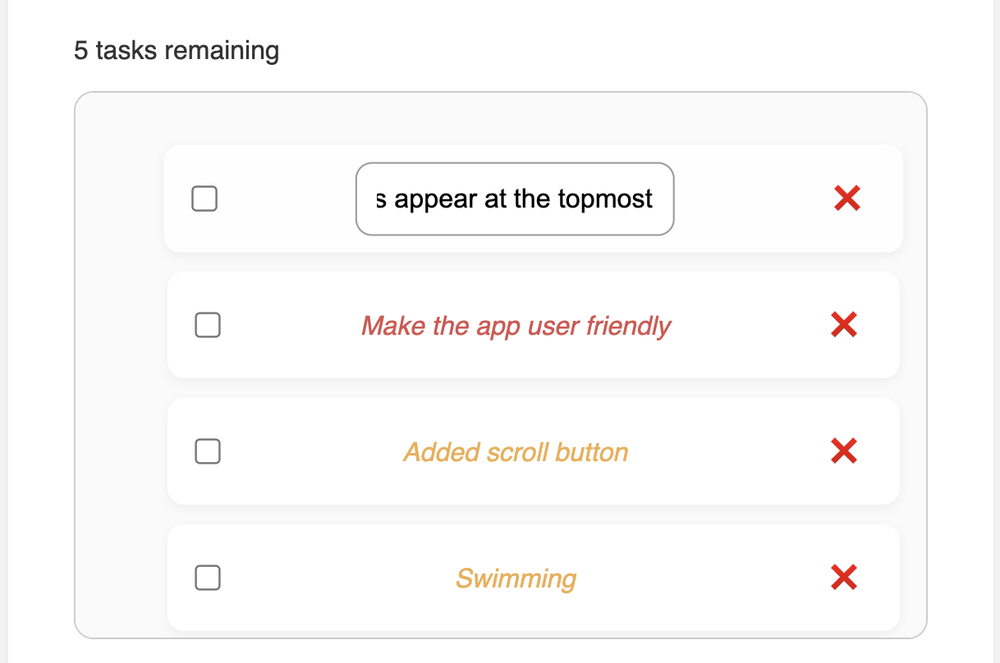
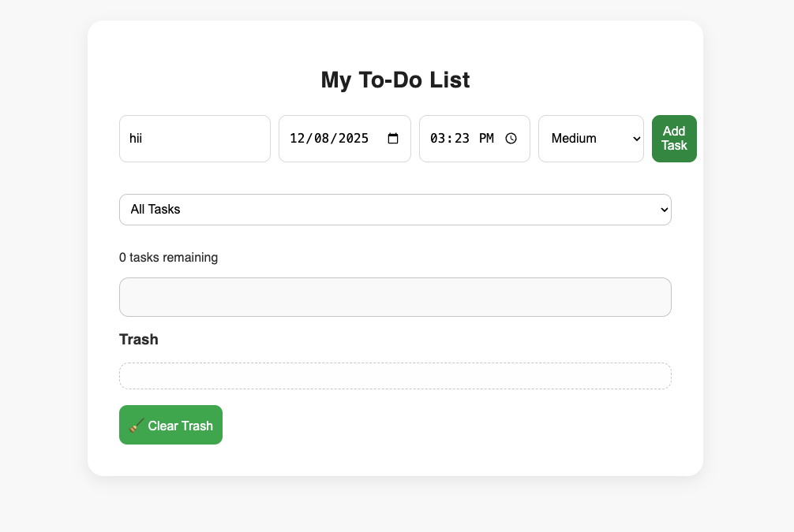
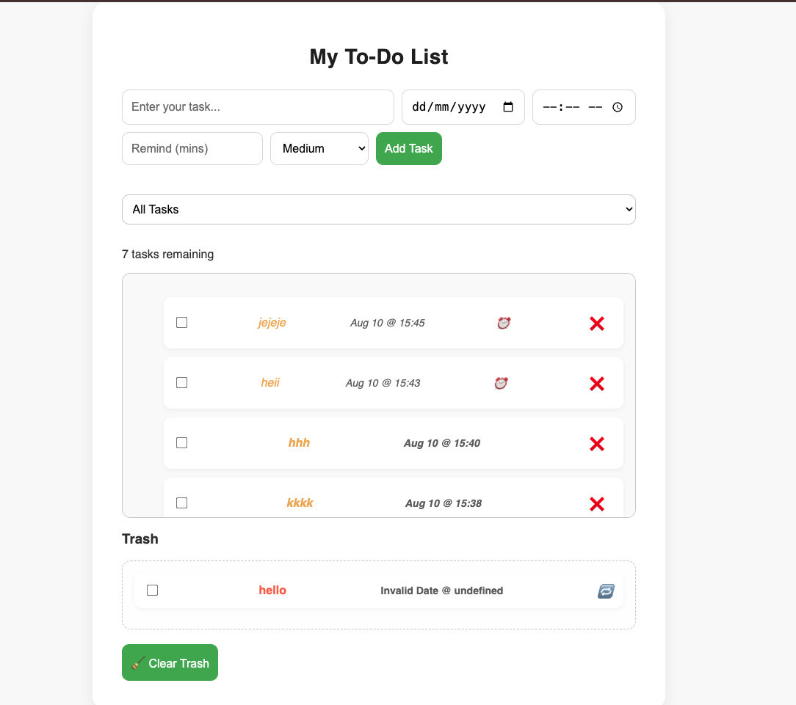

# AI-Powered To-Do List App

## [Live Demo] (https://sanjanasaithal.github.io/todo-app-ai-powered/) 

## Description
A beginner-friendly, AI-guided to-do list web app built using HTML, CSS, and JavaScript. Users can add, manage, and organize tasks with priority levels, due dates, and reminders.

## Features
- ✅ Add tasks with **priority levels** (Low, Medium, High)
- ✅ Add **due dates and times** to tasks
- ✅ **Receive reminders** before a task is due
- ✅ Automatically identify and **highlight delayed tasks**
- ✅ Mark tasks as complete/incomplete
- ✅ Store data with LocalStorage
- ✅ Responsive UI


## Learning Goals
- Use ChatGPT to plan, build, and debug a full project
- Understand how frontend development works
- Use GitHub professionally as a portfolio

## Project Progress

- Day 1: Setup project folder, GitHub repo, README
- Day 2: HTML + CSS layout complete
- Day 3: Added JavaScript logic to add tasks with priority
- Day 4: Added delete functionality to each task
- Day 5: Added task completion checkbox
- Day 6: Task Filtering
- Day 7: Task Counter Feature
- Day 8: Local Storage
- Day 9: Trash Area and Restorability
- Day 10: Clear trash button + cleaner UI
- Day 11: Editing task name
- Day 12: Added due dates and times to tasks
- Day 13: Implemented overdue task highlighting
- Day 14: Added a task reminder feature
- Day 15: Polished UI/UX for new features and squashed bugs

## 📦 How to Run Locally
```bash
git clone <repo-url>
open index.html


![Delete functionality to each task] (screenshots/day4.png)

![Checkbox addition, and strikethrough on completion] (screenshots/day5.png)


![Day 7 task counter feature] (screenshots/day7.png)

![Day 9 trash area feature] (screenshots/day9.png)

![Day 10 clear trash feature] (screenshots/day10.png)








**Sanjana Aithal**

- [GitHub](https://github.com/SanjanaSAithal)
- [LinkedIn] (https://www.linkedin.com/in/sanjana-s-aithal-7aaa59337/)

