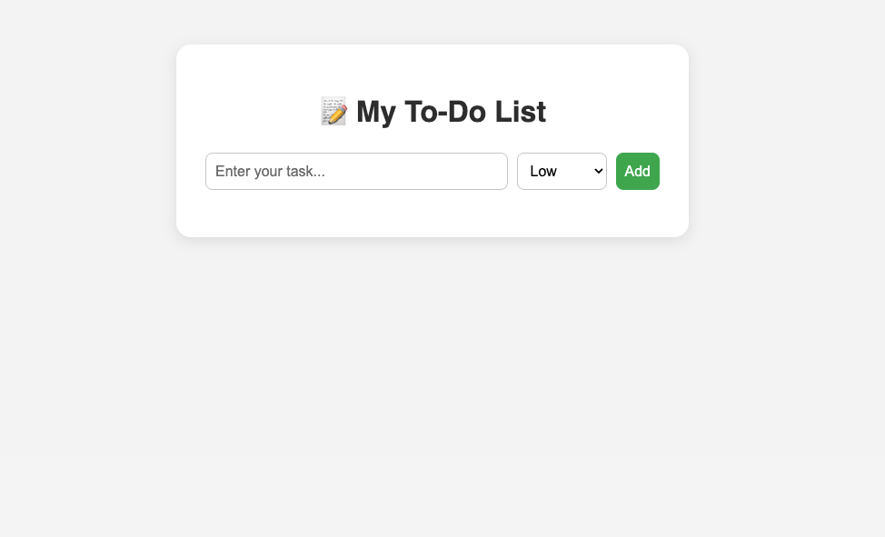
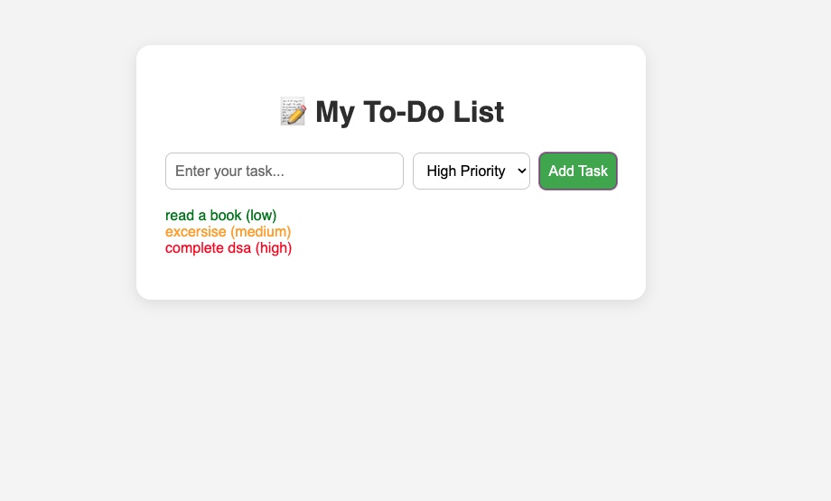
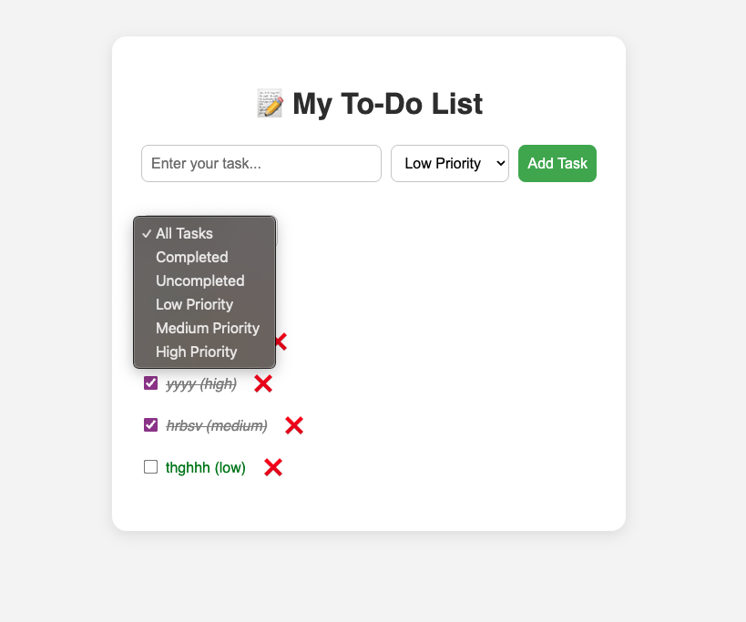

# AI-Powered To-Do List App

## 🔧 Description
A beginner-friendly, AI-guided to-do list web app built using HTML, CSS, and JavaScript. Users can add, manage, and organize tasks with categories and priority levels.

##  Features
- ✅ Users can add tasks with priority levels (Low, Medium, High)
- Mark tasks as complete/incomplete
- Store data with LocalStorage
- Responsive UI

## Learning Goals
- Use ChatGPT to plan, build, and debug a full project
- Understand how frontend development works
- Use GitHub professionally as a portfolio

## 🗓️ Project Progress

- ✅ Day 1: Setup project folder, GitHub repo, README
- ✅ Day 2: HTML + CSS layout complete
- ✅ Day 3: Added JavaScript logic to add tasks with priority
- ✅ Day 4: Added delete functionality to each task
- ✅ Day 5: Added task completion checkbox
- ✅ Day 6: Task Filtering
- ✅ Day 7: Task Counter Feature
- ✅ Day 8: Local Storage 

## 📦 How to Run Locally
```bash
git clone <repo-url>
open index.html

## 🖼️ Screenshots

### 📸 Screenshot (Day 3)


![Delete functionality to each task] (screenshots/day4.png)

![Checkbox addition, and strikethrough on completion] (screenshots/day5.png)


![Day 7 task counter feature] (screenshots/day7.png)


## 🙌 Author
**Sanjana Aithal**

- [GitHub](https://github.com/SanjanaSAithal)
- [LinkedIn] (https://www.linkedin.com/in/sanjana-s-aithal-7aaa59337/)

